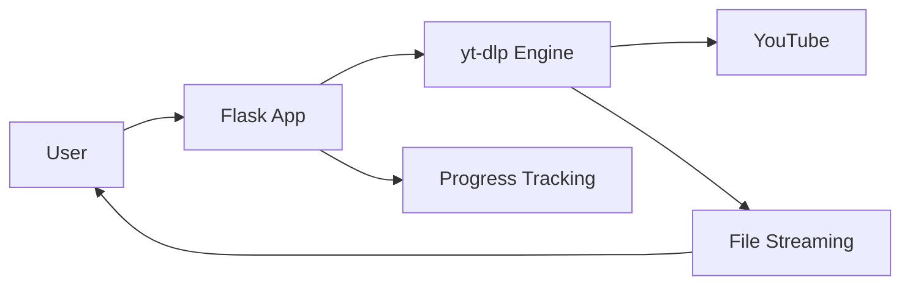

# 📺 YouTube Downloader

A simple, modern web application for downloading YouTube videos with a clean interface and cloud deployment support.


## ✨ Features

- 🎯 **Simple Interface**: Clean, modern UI with progress tracking
- 🔄 **Multiple Fallbacks**: Browser, Android, and iOS client simulation
- 🛡️ **Anti-Detection**: Advanced techniques to bypass YouTube restrictions
- 🌐 **Cloud Ready**: Optimized for cloud deployment
-  **Diagnostics**: Built-in server status checking

## 🚀 Quick Start

### Local Development

1. **Clone and setup**
   ```bash
   git clone https://github.com/hongbo-wei/youtube-downloader.git
   cd youtube-downloader
   python -m venv .venv
   source .venv/bin/activate  # On Windows: .venv\Scripts\activate
   pip install -r requirements.txt
   ```

2. **Run the application**
   ```bash
   python app.py
   ```

3. **Open your browser**
   ```
   http://localhost:8000
   ```

### 🌐 Local Deployment with Public URL

**Using Cloudflare Tunnel (Recommended)**

1. **Install Cloudflare Tunnel**
   ```bash
   # macOS
   brew install cloudflared
   
   # Linux
   wget https://github.com/cloudflare/cloudflared/releases/latest/download/cloudflared-linux-amd64.deb
   sudo dpkg -i cloudflared-linux-amd64.deb
   ```

2. **Start your app and create public tunnel**
   ```bash
   python app.py  # Terminal 1
   cloudflared tunnel --url http://localhost:8000  # Terminal 2
   ```

3. **Share the public URL**
   - Cloudflare provides a URL like: `https://abc-def-ghi.trycloudflare.com`
   - Others can access your local app through this URL

### ☁️ Cloud Deployment

**Render.com (Recommended)**
1. Fork this repository
2. Connect to Render.com
3. Create a new Web Service
4. Build Command: `pip install -r requirements.txt`
5. Start Command: `gunicorn --config gunicorn.conf.py wsgi:app`

**Other Platforms**
- **Heroku**: Uses included `Procfile`
- **Railway**: Auto-detects Python setup

## 🏗️ Architecture



## 📁 Project Structure

```
youtube-downloader/
├── app.py                 # Main Flask application
├── wsgi.py               # WSGI entry point for production
├── requirements.txt      # Python dependencies
├── templates/index.html  # Web interface
├── static/               # CSS and JavaScript files
└── Procfile             # Cloud deployment config
```

## 🔧 API Endpoints

- `GET /` - Main interface
- `POST /download` - Start download
- `GET /progress/<id>` - Check download progress
- `GET /stream/<id>` - Download file
- `GET /health` - Server diagnostics

## 🐛 Troubleshooting

**"Video unavailable" on cloud servers**
- YouTube blocks many cloud server IPs
- Solution: Use local deployment with Cloudflare Tunnel

**Static files not loading**
- Verify `static/` folder exists with `css/` and `js/` subdirectories
- Clear browser cache

**Port conflicts**
- Change port in `app.py`: `app.run(port=8001)`

## 🆘 Support

1. **Use the diagnostic tool** - Built into the app (🔍 Check Status button)
2. **Run locally** - Most reliable for consistent downloads
3. **Open an issue** - For bugs or feature requests

## 📄 License

MIT License

---

💡 **Note**: For the most reliable downloads, use local deployment with Cloudflare Tunnel due to YouTube's cloud IP restrictions.
