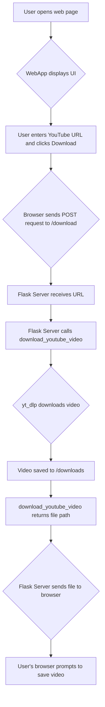

```mermaid
graph TD
    A[User opens web page] --> B{WebApp displays UI};
    B --> C[User enters YouTube URL and clicks Download];
    C --> D{Browser sends POST request to /download};
    D --> E[Flask Server receives URL];
    E --> F[Flask Server calls download_youtube_video];
    F --> G{yt_dlp downloads video};
    G --> H[Video saved to /downloads];
    H --> I[download_youtube_video returns file path];
    I --> J{Flask Server sends file to browser};
    J --> K[User's browser prompts to save video];
```
