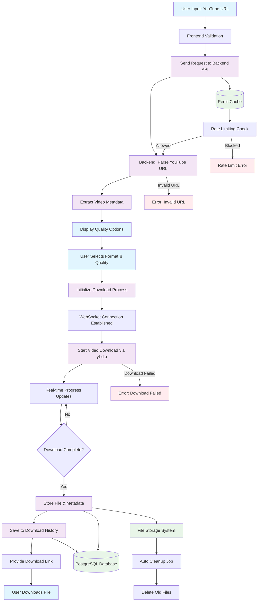

```mermaid
graph TD
    A[User Input: YouTube URL] --> B[Frontend Validation]
    B --> C[Send Request to Backend API]
    C --> D[Backend: Parse YouTube URL]
    D --> E[Extract Video Metadata]
    E --> F[Display Quality Options]
    F --> G[User Selects Format & Quality]
    G --> H[Initialize Download Process]
    H --> I[WebSocket Connection Established]
    I --> J[Start Video Download via yt-dlp]
    J --> K[Real-time Progress Updates]
    K --> L{Download Complete?}
    L -->|No| K
    L -->|Yes| M[Store File & Metadata]
    M --> N[Save to Download History]
    N --> O[Provide Download Link]
    O --> P[User Downloads File]
    
    %% Database Operations
    M --> Q[(PostgreSQL Database)]
    N --> Q
    
    %% Cache & Rate Limiting
    C --> R[(Redis Cache)]
    R --> S[Rate Limiting Check]
    S -->|Allowed| D
    S -->|Blocked| T[Rate Limit Error]
    
    %% File Management
    M --> U[File Storage System]
    U --> V[Auto Cleanup Job]
    V --> W[Delete Old Files]
    
    %% Error Handling
    D -->|Invalid URL| X[Error: Invalid URL]
    J -->|Download Failed| Y[Error: Download Failed]
    
    %% Styling
    classDef userAction fill:#e1f5fe
    classDef backend fill:#f3e5f5
    classDef database fill:#e8f5e8
    classDef error fill:#ffebee
    
    class A,F,G,P userAction
    class C,D,E,H,J,M,N backend
    class Q,R,U database
    class T,X,Y error
```